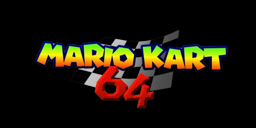

# Mario Kart 64 for Nintendo 3DS



An experimental native Nintendo 3DS port of the vanilla Mario Kart 64 game code, based on
[SpaghettiKart](https://github.com/HarbourMasters/SpaghettiKart). The top screen supports a Wide 5:3 viewport and a
centered Original 4:3 viewport. The default mode renders at 400x240; every model except the original Nintendo 2DS can
also select an 800-pixel horizontal rendering mode after restarting. The bottom screen provides a dimmed game backdrop,
touch-enabled options and diagnostics, and an automatic race HUD.

This repository contains no ROM, extracted game data, or copyrighted Nintendo assets. Put your legally owned
Mario Kart 64 USA ROM in `sd:/3ds/MK64/`. The 3DS app creates and uses that folder as the local game-data
workspace.

## Current status

The native ARM11 executable, on-device O2R generator, Citro3D Fast3D renderer, O2R resource runtime, bottom-screen
interface, 3DS input, NDSP audio output, and 3DSX/CIA packaging pipeline compile successfully. The vanilla game
remains a work in progress and is not yet a stable release.

The v0.20 pre-release rebuilds the native bottom-screen interface with the game's own font and HUD textures. Game
Select shows only the smaller stock `L Option` and `R Data` entries over a correctly oriented, aspect-filled menu
background at roughly 20% visibility. Options captures controller and touch input without changing the top-screen
selection and provides Game, Screen, Gameplay, and Developer tabs without the earlier blue frames. During a race, the
bottom screen uses the selected course preview as a correctly oriented crop at roughly 20% visibility. Its upper row
contains lap, the live item roulette, and time; the animated leading-four ranking, current place, and minimap use the
same live state and assets as the original HUD. With Top HUD off, `Y` cycles only no top overlay, lap progress, and the
speedometer. Pausing now opens one lower-screen interface with Continue Game and Quit while the top screen retains only
the centered cup/class/course title. Settings are stored locally in `sd:/3ds/MK64/mk64-3ds.cfg`.

The renderer preserves the red, green, and blue-purple filters used by Game Select, Player Select, and Course
Select even when an N64 combiner leaves too few PICA200 stages for the exact grayscale pass. A clean 3DS build also
uses fixed-width stock shading behind unselected character portraits without covering adjacent cells. The FPS counter uses the same native font,
has no black backing box, and keeps fixed storage so race frames cannot corrupt its text.

Mario Kart 64's simulation remains 30 Hz. At the default 400-pixel setting on New Nintendo 3DS, v0.20 can present a
bounded matrix-interpolated midpoint between simulation key frames. The adaptive presenter skips that extra decode and
presentation when frame time, texture uploads, resource loading, Citro3D, or the audio safety margin indicates pressure;
the mandatory key frame is never skipped, and a monotonic 30 Hz deadline prevents an omitted midpoint from speeding up
the simulation. Old Nintendo 3DS and the 800-pixel quality mode present key frames at a 30 Hz target. These are
implementation targets, not measured guarantees: sustained 60 FPS and 30 FPS are not claimed without representative
physical-hardware captures.

Race setup preloads display-list texture dependencies within fixed 1 MiB/2,048-entry limits and a bounded five-frame,
four-wheel kart window for each one-player racer. The unsupported per-frame CPU framebuffer readback and zero-filled
jumbotron upload path is omitted on 3DS, recovering roughly 450 KiB of static memory and substantial race-frame work.
Toad's Turnpike traffic restores its original every-other-logic-tick cadence instead of evaluating all 28 traffic paths
twice per key frame. Indexed O2R reads, constant-time prefetch deduplication, buffered diagnostics, and aggregate
telemetry remove repeated name scans and hot-path SD logging. Audio synthesis uses an auxiliary ARM11 core when the
model permits it, with a safe synchronous fallback. Six NDSP waves and a bounded two-block refill target absorb short
stalls without advancing audio when no output wave is reusable. Runtime telemetry records simulation pumps, synthesis
blocks, catch-up pumps, queue failures, and observed empty-buffer transitions separately.

These choices were informed by a source-level review of
[Super Mario 64 3DS Port Ultimate](https://github.com/Epic0522/Super-Mario-64-3ds-port---Ultimate): New-3DS CPU/L2
configuration, 400/800-pixel display paths, fixed memory, auxiliary-core audio work, fast cache flushes, and conservative
frame pacing were adapted where their invariants fit this port. Its enhanced RSPA and game-specific renderer code were
not copied.

First-run extraction now processes each large kart metadata file in bounded 64-texture chunks. Each texture is written
to the SD-backed O2R immediately and released before the next chunk, instead of building duplicate full YAML trees and
retaining thousands of parsed textures in RAM. The ZIP central directory is spooled separately on the SD card, parsed
payloads and address indices are released after their last consumer, and finished audio/decompression state is freed
before the kart phase. The corrected extractor emits 32,445 canonical entries; older complete archives with two unused
legacy vertex aliases remain accepted. A new archive must meet that completeness floor and every payload is read back
with CRC verification before the temporary file is atomically finalized. Non-resumable partial archives and abandoned
central-directory spools are removed before a retry, legacy v0.18 partial quarantines are reclaimed, and diagnostic
quarantine now keeps only the newest rejected archive of each class instead of growing without a bound.

During extraction, lid-close sleep and HOME suspension are disabled so the console can continue unattended; display
refreshes stop while the lid is closed, and a lightweight shell-state watcher restores the latest framebuffer when the
lid opens. The progress bar assigns ROM search and SHA-1 verification only 1–8%, preparation 9–15%, O2R generation
16–88%, complete payload/CRC readback 89–99%, and 100% only after the validated temporary archive is atomically moved
into place. The app then requests a persistent blue notification LED and restores the previous sleep policy. The LED is
best-effort on 3DSX environments that do not grant the MCU service. Keep the console charged for a long first-run
extraction. Complete extraction, lid behavior, and the notification LED still require physical Nintendo 3DS testing.

Dynamic course video-screen readback is unsupported by the Citro3D backend, so those billboards retain their static
course textures. Old Nintendo 3DS and New Nintendo 3DS performance still require real-hardware profiling.

## Build

Requirements:

- devkitPro with devkitARM, libctru, Citro3D, and the 3DS CMake toolchain
- CMake 3.20 or newer
- `makerom` and `bannertool` for CIA packaging (the 3DSX build does not require them)

Clone with submodules, then run:

```sh
git submodule update --init --recursive
./platform/3ds/build.sh
```

The CLI writes the game package to:

```text
build-3ds/game/mk64-3ds-game-v0.20.3dsx
build-3ds/game/mk64-3ds-v0.20.cia
```

If `makerom` and `bannertool` are not on `PATH`, set `MK64_3DS_TOOLS_ROOT` to a private directory containing their
executables. Packaging tools are not vendored in this repository.

## Install game data

Create this folder on your SD card:

```text
sd:/3ds/MK64/
```

Place your legally owned Mario Kart 64 USA ROM there. Supported names:

```text
sd:/3ds/MK64/Mario Kart 64.z64
sd:/3ds/MK64/mk64.z64
sd:/3ds/MK64/baserom.us.z64
```

On first boot, the 3DS build checks the ROM, copies its public extraction metadata into the local MK64 folder,
and shows a preparation screen while it writes the O2R directly to the SD card. Large kart files are streamed in
bounded chunks, so completed texture data does not remain in RAM. You may close the lid during this step; the app
temporarily prevents sleep and stops display refresh while extraction continues. If extraction succeeds, it creates:

```text
sd:/3ds/MK64/mk64.o2r
```

The final archive is only moved into place after it closes, meets the 32,445-entry completeness floor and required-
resource checks, and every present payload passes readback/CRC validation, so an interrupted installation is retried
on the next launch. A blue notification LED is requested after successful finalization. Later launches reuse that
generated archive. This release does not embed or redistribute the ROM, generated O2R archive, or extracted game data.

If preparation stops, copy the local diagnostic file from the SD card before retrying:

```text
sd:/3ds/MK64/mk64-install.log
```

The log records the ROM check, RomFS metadata copy, every bottom-screen progress line, per-YAML O2R stages,
heap/linear-memory checkpoints, finalization, multi-line errors, and SD-card I/O error codes.
It is created on the SD card only; do not attach it to a public issue or release because it may contain local device
details.

During this first-run step the top screen shows the bundled loading image with an overlaid progress bar, while the
bottom screen mirrors the live installer output. The game memory arena is reserved after game-data preparation,
the ROM is loaded after the Torch configuration is parsed, and the 3DS O2R writer spools the ZIP central directory to
the SD card instead of keeping it in RAM. Large kart YAML files are parsed in 64-asset chunks, parsed audio state is
released before those chunks begin, and decompression caches are destroyed at each chunk boundary. The 3DS cartridge
and read-only binary readers borrow their input buffers, Torch hash-cache generation is disabled for this one-shot
installer, and memory checkpoints are included in the local installation log. Runtime memory is based on the 64 MiB
Old 3DS application limit; the renderer uses the vanilla
archive's actual texture-size requirements rather than reserving a 1024x1024 upload surface.

Install the CIA with your normal homebrew installer, or place the 3DSX in a Homebrew Launcher application folder.

## Controls

| Nintendo 3DS | Nintendo 64 |
| --- | --- |
| Circle Pad | Control Stick |
| A / B | A / B |
| R | R (hop/drift) |
| L | Use item during a race; open bottom Options from Game Select |
| Select | Save a diagnostic dump (not passed to the game) |
| D-Pad | D-Pad |
| X | C-Up / camera distance |
| Y | Cycle the top HUD during a race; C-Left outside races |
| ZL / ZR | C-Down / C-Right outside races |
| C Stick | Hold for the selected Turbo Speed during a race |
| Touch screen | Open and navigate bottom-screen controls |
| Start | Start |

## Bottom-screen options

Open Options with `L` from Game Select. The same panel opens automatically when a race is paused. Use the D-Pad and
`A`/`B`, switch tabs with `L`/`R`, or tap the touch screen. While the panel is open, its input is captured and does not
change the top-screen menu.

- **Screen:** Wide or Original 4:3 aspect ratio, top HUD on/off, and 400/800-pixel rendering. The 800-pixel mode is
  unavailable on the original Nintendo 2DS, requires a restart, and uses a 30 Hz presentation target. The default
  400-pixel mode is recommended on Old Nintendo 3DS for performance.
- **Gameplay:** C-Stick Turbo Speed from x1 through x5 and saturating master volume at 25, 50, 75, 100, 150, or 200%.
- **Developer:** request a local memory dump, show a two-second FPS value on the top screen, or open a diagnostic
  overlay with version, console model, two- and ten-second FPS, memory, renderer, audio, state, and course data.

## Runtime diagnostics

Every game launch writes a local stage log to:

```text
sd:/3ds/MK64/dump/runtime.log
```

After a forced reboot, copy this file before launching the port again because the next launch replaces it.

Press `Select`, or hold `L + R + A` together, to create a timestamped diagnostic session under:

```text
sd:/3ds/MK64/dump/dump-YYYYMMDD-HHMMSS/
```

The diagnostic input worker is independent of the main game loop, so the shortcut can still be detected when the
renderer thread is stuck. A session contains `info.txt`, a copy of `runtime.log`, the active game arena when it is
readable, and the current display list when available. `info.txt` records the current startup/rendering stage,
resource name, memory-region totals, heap use, display-list watchdog state, and the process memory map.

These files remain on the SD card and may contain private device details or owner-generated game data. Inspect or
share only the small text files privately when possible; never publish the raw binary dumps in a repository or
release.

## Upstream and legal notice

SpaghettiKart and its submodules retain their respective upstream licenses and notices. This project is an
unofficial fan port and is not affiliated with or endorsed by Nintendo or Harbour Masters. Mario Kart and Nintendo
3DS are trademarks of Nintendo.
